

**Table of Contents**
{: #toc }
*  TOC
{:toc}

<!-- /.medium-4.columns -->

# Intro to BCI

## What is the definition

## What are  the types of BCI's
There are many different techniques to measure brain signals.

We can divide them into Invasive, Semi-invasive and Non-Invasive.

| Option | Description | Pic |
| ------ | ----------- | ---- |
| Non-invasive   | The sensors are placed on the scalp to measure the electrical potentials produced by the brain (EEG) or the magnetic field (MEG). | 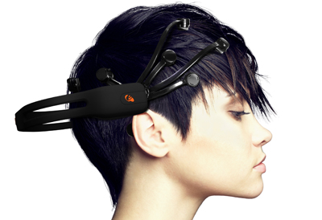 |
| Semi-invasive | The electrodes are placed on the exposed surface of the brain(ECoG).|  |
| Invasive    | The micro-electrodes are placed directly into the cortex, measuring the activity of a single neuron. |  |

The following image shows the different layers of the brain and where the signal is taken from.

**Non-invasive**: the EEG signal is taken placing electrodes on the scalp, so on the most external part.

**Semi-invasive**: the ECoG signal is taken from electrodes placed in the dura or in the arachnoid.

**Invasive**: the Intraparenchymal signal is taken directly implanting electrodes in the cortex.

[Layers of the Brain and Signal Source](../images/introtobci/layers.png)

### Invasive

Invasive types of BCI are implanted directly into the brain during a neurosurgery.
There are single unit BCIs, which detect the signal from a single area of brain cells, and multiunit BCIs which detects from multiple areas. Electrodes have different lengths, for example, up to 1.5 mm (Utah, Blackrock Microsystems) or 10 mm (FMA, MicroProbes) in a MEA [(1)](#references) . The quality of the signal is the highest, but the procedure has several problematics , as the risk of forming scar tissues. The body reacts to the foreign object and build the the scar around the electrodes, which cause deterioration in the signal. Because neurosurgery can be a risky and expensive process, the target of invasive BCI are mainly blind and paralyzed patients.

### Semi-Invasive
#### ECoG
Electrocorticography uses electrodes placed on the exposed surface of the brain to measure electrical activity from the cerebral cortex. It has been used for the first time in the 1950s at the Montreal Neurological Institute.
It is called semi-invasive but it still requires a craniotomy to implant the electrodes. For this reason it is used only when surgery is necessary for medical reasons (epilepsy for example).

The electrodes may be placed outside the dura mater (epidural) or under the dura mater (subdural).
The strip or grid electrodes covers a large area of the cortex (from 4 to 256 electrodes)[(2)](#references), allowing a diverse range of cognitive studies.

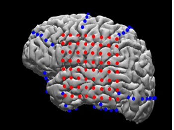

*In the image: MRI reconstruction of the patient’s brain with electrodes overlaid (red: grid array; blue: strip arrays) to allow precise matching of neurophysiological activity to neuroanatomical structures (Image from: Yang et al., Neuroimage, 2012)*

[(3)](#references)

The positive characteristics of ECoG are:

*         high spatial resolution and signal fidelity
*         resistance to noise
*         lower clinical risk and Robustness over long recording period[1]
*         higher amplitude

**Spatial resolution**

A benefit of the ECoG over EEG, is that the spatial resolution is much higher because the signal doesn’t have to travel to reach the scalp. The spatial resolution in ECoG is tenths of millimeters, while it is centimeters in EEG [(4)](#references).

---------------------------------------------------------------------------------------------------------------------
What do we mean by spatial resolution?
We can take, as an analogy, the clarity of an image.
A picture with a higher spatial resolution is “clearer”; in other words, it looks more precise because it is composed of more pixels per inch, showing more details. A picture with lower spatial resolution appears less clear, or more blurry because it is composed of fewer pixels per inch.
Better spatial resolution allows us to understand with better precision where the signal is coming from. In the case of EEG, when the electrical signal travels through the skull, it is attenuated due to the low conductivity of the bones.
---------------------------------------------------------------------------------------------------------------------

**Resistance to noise**

ECoG signal is not impacted by noise and artifacts as for example EMG (electromyographic - caused by muscles movements) and EOG (electrooculographic - caused by eyes movements)

**Lower clinical risk**

The electrode arrays doesn’t need to penetrate into the cortex, which makes it safer than invasive recording [(4)](#references)

**Higher amplitude**

ECoG recordings are 50–100 µV maximum versus 10–20 µV

**In BCI**

There have been different studies about the use of ECoG in BCI, but they are all limited to cases where surgery was needed to remove an epileptic focus.

In one study [(5)](#references) for example, the researcher used ECoG to control a computer cursor in two dimensions.
Five patients, in preparation of surgery for epilepsy, had a subdural array of electrodes implanted for 7-14 days.  After a short training of less than 30 minutes, the patients have been able to control a cursor in two dimensions, with an average success rate of 53-73%.

### Non Invasive

In the following section we will review briefly the main non-invasive techniques.
There are several non-invasive techniques used to study the brain, where EEG is the most common used because of the cost and hardware portability.

*     MEG magnetoencephalography
*     PET positron emission tomography
*     fMRI functional magnetic resonance imaging
*     fNIRS near-infrared spectroscopy
*     EEG Electroencephalography

In the following image is possible to see the different brain imaging techniques, compared by spatial and temporal resolution:

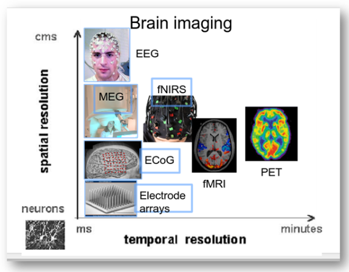

### MEG
**magnetoencephalography**

**What is it?**

From Wikipedia “is a functional neuroimaging technique for mapping brain activity by recording magnetic fields produced by electrical currents occurring naturally in the brain, using very sensitive magnetometers.“

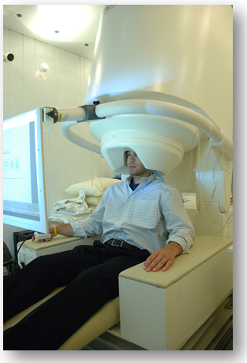
In the image: MEG scanner with patient from National Institute of Mental Health [(6)](#references)

**How does it work?**

MEG measures the magnetic field caused by the currents in the brain, and it offers a better spatial resolution compared to EEG [(7)](#references). Why? Because magnetic fields suffer far less than electric fields from the spatial blurring effect of the skull and intracerebral fluid [(8)](#references).
“MEG is maximally sensitive to tangential sources and has low sensitivity to radial sources”
“MEG is better than EEG at detecting high-frequency activity (e.g., above 60 Hz). This is
because magnetic fields pass through the skull and scalp, whereas the electrical fields are
volume conducted through these tissues, which decreases signal-to-noise ratio at higher
frequencies.”

### PET
**positron emission tomography**

**What is it?**
PET is a nuclear imaging technique used in medicine to observe different processes, such as blood flow, metabolism, neurotransmitters, happening  in the body.

*“This image shows a picture taken from a typical PET facility equipped with an ECAT Exact HR+ PET scanner. PET scanners such as this are steadily being replaced by systems that combine both PET and CT scanners into a single PET/CT imaging device.” [(9)](#references)*

**How does it work?**

A small amount of radioactive material, called radiotracer, is injected in the bloodstream to reach the brain. In the case of the brain, the radiotracer get attached to the glucose and creates a radionuclide called fluorodeoxyglucose (FDG) [(10)](#references). The brain uses glucose and it will show different levels based on the level activity of the different regions.
The images of the PET scan are multicolored, where areas with more activities are in warmer colors as yellow and red. PET scans of the brain are used often to detect illnesses as cancer or others.

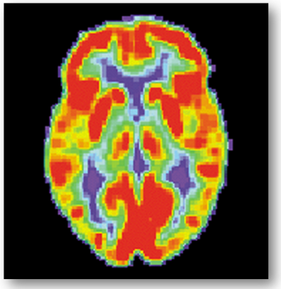

*PET scan of a normal human brain*

### fMRI
**functional magnetic resonance imaging**

**What is?**

*Functional magnetic resonance imaging or functional MRI (fMRI) is a functional neuroimaging procedure using MRI technology that measures brain activity by detecting changes associated with blood flow.[1][2] This technique relies on the fact that cerebral blood flow and neuronal activation are coupled. When an area of the brain is in use, blood flow to that region also increases.* [(11)](#references)

fMRI had been developed in the 1990s. It is a non-invasive and safe technique, it doesn’t use radiation, it’s easy to use and it has excellent spatial and good temporal resolution. [(12)](#references)

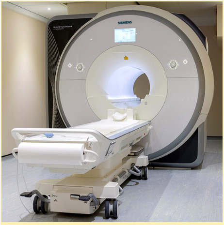

**How does it work?**

In the brain, haemoglobin in capillary red blood cells delivers oxygen to the neurons. Activity causes more demand for oxygen, which leads to an increase of blood flow.
The magnetic characteristics of haemoglobin change if it is or not oxygenated. This difference allows the MRI machine, which is a cylindrical tube with a powerful electro-magnet, to detect which areas of the brain are active in a specific moment.

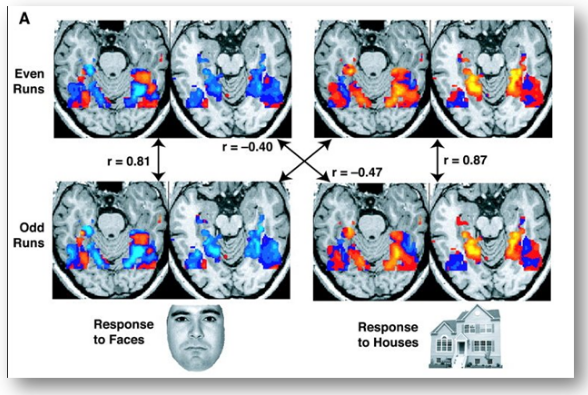
*fMRI images from a study showing parts of the brain lighting up on seeing houses and other parts on seeing faces. The 'r' values are correlations, with higher positive or negative values indicating a better match.*

### fNIRS
**near-infrared spectroscopy**

**What is?**

Functional Near-Infrared Spectroscopy (fNIR or fNIRS), is the use of NIRS (near-infrared spectroscopy) for the purpose of functional neuroimaging. Using fNIR, brain activity is measured through hemodynamic responses associated with neuron behaviour. [(13)](#references)

An optical technique to measure localized cortical brain activity [(14)](#references)

**How does it work?**

fNIRS measures the changes in blood flow as fMRI, but using a different technique, infrared light vs magnetic field.
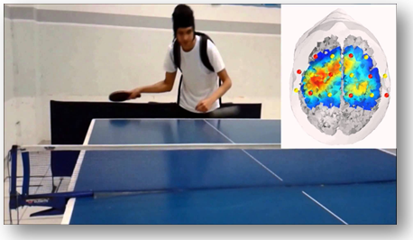

*In the image: fNIRS during table-tennis experiment* [(15)](#references)

When a task begins there is consumption of oxygen, as the complexity increases, also the request for oxygen increases. fMRI measures how much oxygen is consumed. fNIRS measures also how much oxygen is available in the area (overshot).

Still, the temporal quality of fNIRS is not as good as EEG. fNIRS takes 10 samples per second, which is trumped by EEG’s 500 to 1000 samples per second. And the spatial resolution is not as good as fMRI. For example, fMRI can image subcortical brain regions, while fNIRS cannot analyze past the cortex, unable to capture any subcortical activation. Indeed, many researchers who presented their fNIRS at SfN are using the instrument as a supplement to their EEG or fMRI data. [(16)](#references)

Benefits:
* Non-invasive
* Portable
* Accessible
* Less sensible to artifacts compared to fMRI and EEG

Has a temporal resolution more similar to EEG
fMRI may record one sample per 2 seconds, fNIRS can record 10 samples per 1 second. [(17)](#references)

fNIRS better spatial resolution than EEG and better temporal resolution than fMRI

### EEG

**Definition**

EEG provides the recording of electrical activity of the brain from the surface of the scalp.

**How does it work?**

Electrodes are placed on the scalp to pickup the electrical current generated by the brain.

When firing, a neuron forms a dipole, with a lower voltage at synapses and higher voltage at the axon.
If it’s an inhibitory neuron, the dipole is flipped, with lower voltage at axon and higher voltage at the synapses.
What causes this voltage shift inside  a neuron?
Na+ channels open on along the dendrite, causing a flood of positive electrons, this positive charge moves down the axon, opening more sodium channels, and causing an electric charge to carry down the axon, discharging at the synapse, releasing neurotransmitters along with it.
When groups of neurons fire together, they provide enough signal for us to measure from the scalp.
We _only_ able to measure clusters of neurons using EEG (about the size of a quarter in diameter).

Advantages: it is portable, it can fit into a small suitcase (vs MEG which requires special built rooms). Lab grade EEG systems may be expensive, but they are cheaper than other BCI methods. In recent years an increasing number of commercial EEG systems have been released.

EEG data contains rhythmic activity, which reflects neural oscillations.
Oscillations are described by frequency, power and phase.
Oscillations occur at specific frequencies (i.e., at a certain rate). These include delta, theta, alpha, meta, and gamma. Research has found associations between these rhythms and different brain states. For example, commercial EEG headsets - often used for purposes such as meditation - typically measure the amount of brain activity that occurs in the alpha frequency.

**Spatial resolution**

The spatial resolution of EEG is determined by the number of electrodes used.
In research, when higher spatial resolution is desired, typically at least 32 electrodes are used, up to 256.
In general, spatial resolution for EEG is low (e.g., compared to ECoG and fMRI) because the signal needs to travel through different layers up to the skull. The resolution, however, can be improved using certain types of filters or by combining EEG with other tools (e.g., fMRI).
(image of the electrodes placement..)

More electrodes cost more in time (e.g., setup), bandwidth (for data collection and analysis), and money (for material). Commercial headsets often use fewer electrodes because high spatial resolution (i.e., localizing the precise brain regions generating a signal) is not necessarily needed.

“The spatial precision of EEG is fairly low but can be improved by spatial filters such as
the surface Laplacian or adaptive source-space-imaging techniques”

Also spatial accuracy is low, because the activity registered by an electrode is the mixture of different signals generated by different brain regions, close and distant from the one placed under the electrode.
Microscopic scale (less than a few cubic millimeters) = invisible to EEG, potentials are not powerful enough to reach the scalp
Mesoscopic scale (patches of cortex of several cubic millimeters to a few cubic centimeters) = can be detected with EEG but using more than 64 electrodes and spatial filtering techniques.
Macroscopic scale (large region of cortex of many cubic centimeters) = easily measurable with EEG

**Time resolution**

EEG benefit is its excellent time resolution. It is possible to take thousand of snapshots of electrical activity across different sensors in a single second.
In EEG is possible to use multiple electrodes, up to 500, based on the experiment. They are used mounted on caps to allow collecting the data from the same scalp region.

**Comparison**

BCI can use any type of brain imaging. These include fMRI, PET, and NIRS, which rely on changes in blood flow (i.e., hemodynamic response), and MEG and EEG, which measure the brain’s magnetic and electrical activity, respectively. While the spatial resolution of fMRI and NIRS are high, they have poor temporal resolution; MEG and PET have high spatial and temporal resolution; EEG has low spatial but high temporal resolution. Currently, fMRI and MEG rely on expensive, bulky equipment; PET requires the injection of a radioactive substance into the bloodstream. Thus, methods relying on NIRS and, in particular, EEG, are most commonly used.

## Components
### Brain activity

The nervous system is composed by two main parts: the central nervous system and the peripheral nervous system.
The brain is the main organ of the central nervous system and it  contains about 100 billions of neurons and trillions of cells called glia.
The brain is composed by three major parts: the cerebrum (or cortex), the cerebellum (or little brain) and the brain stem.
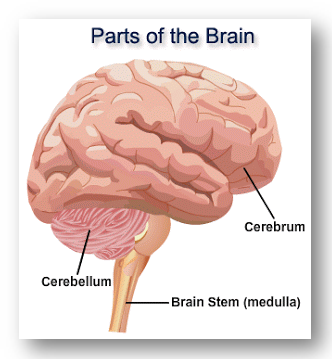 [(18)](#references)

The cerebral cortex (or cerebrum) is divided into four main sections called lobes:
Frontal lobe, parietal lobe, temporal lobe and occipital lobe.

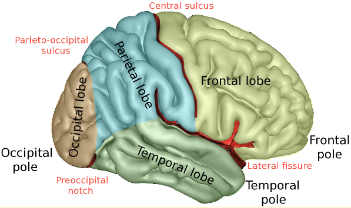 [(19)](#references)

The brain is constantly generating electric signals.
The skull and skin of the head are very good electrical insulators though, making difficult to record from individual neurons.
But when a big number of neurons do the same thing at the same time, it is possible to see the activity with electrodes placed on the surface of the scalp.

* Nerve cells -> respond to stimuli and transmit information over long distances

	Are composed by:
   * Axons -> long cylinder which transmits an electrical impulse and can be several meters long in vertebrates. In humans from a percentage of a millimetre to more than a metre. Axonal transport system for delivering proteins
   * Dendrites -> are connected to axons or dendrites of other cells - receives impulses from other nerves or relay the signals to other nerves.
   * Cell bodies -> single nucleus and contains most of the nerve cell metabolism

* Glia cells - Located between neurons

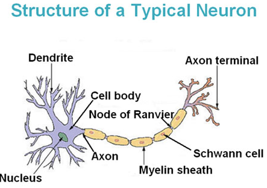 [(20)](#references)

In the human brain, each nerve is connected to approximately 10 000 other nerves, mostly through dendritic connections. [(21)](#references)

When the neurons communicate, currents occurs: an electrical signal is transmitted along an axon or a dendrite. The electrical signal at the end of the axon is converted into a chemical signal and the axon releases chemical messengers called neurotransmitters. The neurotransmitters travel through the synapse to the dendrite and are converted back to electrical signals.

Where a current is leaving, there is a positive polarity, where a current is entering a negative polarity. These currents, called primary currents, are embedded in the brain tissue and brain liquor and reach the skull and scalp. The voltage differences at the scalp can be picked up by EEG electrodes. The main signals generating in the EEG are voltage gradients along dendrites in the upper cortical layers. To have a measurable signal, thousands of parallely oriented neighbouring dendrites have to be active synchronously. [(22)](#references)
The signals possible to measure through EEG are:

1) Action potentials along the axons connecting neurons

2) currents through the synaptic clefts connecting axons with neurons/dendrites

3) currents along dendrites from synapses to the soma of neurons
[(23)](#references)

### Signal acquisition

In the case of EEG-BCI, the electric potential of the brain activity is measured through electrodes placed on the scalp.
Electrodes are metal discs placed on the scap in positions measured using the International 10/20 system.

There are two main types of electrodes:

**Wet** - using saline solution of gel. Conductivity is increased because the electrical distance is minimized. The majority are made of stainless steel, tin, gold or silver and which are covered with a silver chloride coating.

*In the image, gold coated EEG electrodes*

**Dry** - more convenient and easier to use, but can lose higher frequencies
Photo - more info

To help the position, as many electrodes are required -> cap

EEG is reliable for real-time applications as it can take measurements every thousandths of a second.
EEG problem is noise. Being the electrodes placed on the scalp, there are layers in between, plus background noise and muscles.

**HOW EEG ACQUISITION WORKS?**

EEG measures the electric activity happening in the brain. What is recorded is the voltage difference between minimum 2 electrodes. The EEG needs to be recorded simultaneously from multiple electrodes, in order to interpret ERP.
During synaptic excitation of the dendrites in the neurons, electric currents are generated and picked up by the EEG.
Because the signal detected is poor, being the electrodes far from the neurons and having the signal to travel through bones and skull, to record the electric flow is then required an amplifier.

**What is needed?**

* Electrodes - usually made of silver chloride
* Amplifiers
* A/D converters
* Recording Device

“The electrodes acquire the signal from the scalp, the amplifiers process the analog signal to enlarge the amplitude of the EEG signals so that the A/D converter can digitalize the signal in a more accurate way. Finally, the recording device, which may be a personal computer or similar, stores, and displays the data.” [(24)](#references)

**Electrodes**

As previously introduced, different types of electrodes are available to use in EEG, such as: disposable (dry or wet), reusable disc electrodes (gold, silver, stainless steel or tin), headbands and electrodes caps (such as the consumer ones), saline-based electrodes, needle electrodes [(25)](#references) .
In the 1958 a standard system of electrodes placement had been developed, where the head is divided in proportional distances (Jasper, 1958).

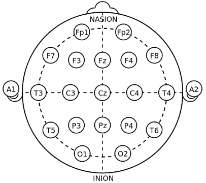
*In the image: electrode locations of International 10-20 system for EEG (electroencephalography) recording* [(26)](#references)

The minimal configuration is composed by three electrodes: active electrode, reference electrode and ground electrode. The EEG measures the potential difference over time between signal or active electrode and the reference electrode. It is very difficult to get a reference where no electrical activity from the brain is present. Usually it is located on the mastoid, ear lobes or tip of the nose. The ground electrode is used to measure the differential voltage between the active and the reference points.

**Amplifier**

The signal picked up by the electrodes is far away and attenuated by the different layers it has to travel. For this reason an amplifier is needed to bring the microvolts to a range that can be digitized. The signal is sent to an amplifier through a cable measuring 1-2 metres. Unfortunately the cables can act as antenna and pickup signals, which would interfere with the EEG signal and cause noise to be amplified. Some “active” electrodes include a small pre-amplifier within the electrode, to avoid this noise interference. Unfortunately they are quite large and expensive and might not be appropriate in some situations. [(27)](#references)

**A/D converters**

The A/D converter will convert the amplified signal from analog to digital form. The bandwidth for EEG signals is limited to approximately 100Hz, making 200Hz enough for sampling EEG signals.

**Recording device**

It can be a computer or similar device, which will record, store and display the converted signal.

### Preprocessing

The raw EEG data is often not clean because affected by noise and artifacts.
There are four main sources of noise and artifacts, which are:

1. EEG equipment
2. Electrical interference external to the subject and recording system
3. The leads and electrodes
4. The subject: electrical activity from the heart, eye blinking, eyeball movements, muscles movements in general. [(29)](#references)

Eye blinking are very clear in frontal and occipital recordings, while ECGs (from the heart electrical activity) on the occipital electrodes. “A movement of the eyeball and the eyelids causes a change in the potential field because of the existing potential difference of about 100mV
between the cornea and the retina” [(30)](#references)

The preprocessing step helps to clean the data from the noise and artifacts.
There are different methods and different steps in preprocessing.
Often for example, filters are applied to the data. To remove the DC components of the signal and the drifts are employed high-pass filters, where usually a frequency cut-off of 1Hz is enough. Often also low pass filters can be applied to remove the high frequencies of the signal, because in EEG usually frequencies over 90Hz are not studied. Other methods are used to remove artefacts as the eyeball movements or eye blinking.

After different steps of pre-processing, when the signal is clean from most of the artifacts and noise, the recording is cut in epoch of few seconds: this allows us to have a large number of features from a single EEG recording, and to use them for statistics or to apply classifiers, as we will see in the next sections. [(31)](#references)

### Feature Extraction

The next step is feature extraction: the analysis of the signal and extraction of information.
As the EEG signal is very complex, it is impossible to find meaningful information just looking at it. It is needed then to apply processing algorithms which allows to find content (such as a person’s intent, for example) which would be hidden at a naked eye.
There are many methods for feature extraction, some of them are:
Band powers (BP)
Cross-correlation between EEG band powers
frequency representation (FR)
time-frequency representation (TFR)
Hjorth parameters, parametric modelling
inverse model
and specific techniques used for P300 and VEP such as Peak picking (PP) and Slow cortical potentials calculation (SCPs) [(32)](#references)

### Classification

Another step which can be applied to the signal, now mostly clean from artifacts, is to apply  classification algorithms. Using machine learning techniques it is possible to train a classifier to recognize which features, for example, belongs to one or another class.mathematical
Again, the classification helps to find out which kind of mental task the subject is performing (Ochoa, 2002)

### Translation

After the signal has been classified, the result is passed to the feature translation algorithm. At this point the features need to be translated in the corresponding action required. “For example, a P3 potential could be translated into the selection of the letter that evoked it”
So, in this case, the algorithm will send a command to the feedback device, to select the letter.

### Feedback device

The feedback device receives the command from the translation step. For example it can be the computer, where the signal will be used to move a cursor, or it could be a robotic arm where the data are used to allow movement.

## Applications

## Examples

## Limitations

The current status of BCI has still many limitations to be overcome:

**Hardware / Software**
The first problem is the signal acquisition hardware.
Regarding EEG, the sensors still have acquisition limits. As we have seen, the signal travels distance before being acquired by the EEG machine, and the noise and artefacts are causing important problems. EEG must achieve a good performance in all environments. Reliable electrodes are necessary. The technology must be able to be reliable despite the noise generated by devices, as many BCI are targeted to ill patients, which are often surrounded by many electronic equipments. [(33)](#references)

The best signal we have seen is the one acquired through invasive technology. But the invasive BCIs suffer as well of many limitations. First of all they are implanted only in a small amount of patients which requires surgery for other reasons. There are ethical issues involved with invasive technology (? check ethical section ?). The problems to overcome are complex: the system need to be safe and remain intact, functional and reliable for decades. The safety long term must be demonstrated, as the implant could potentially open the way to infections or be rejected by the body. The implant must have external elements that are robust, comfortable, convenient, and unobtrusive; and interfaces easily with high-performance applications. And safe. [(34)](#references)
When used to study the brain, invasive technology might not have the best models, being implanted in patients with problems or injuries which does not make them the ideal candidates.
BCI validation and dissemination
Reliability [(35)](#references)

**Current understanding of biological signals and Variability**

The problem is that is difficult to decode the signal or it requires months of training and it’s different for each person - not standard. The variability of signal features causes a need for adaptive BCI algorithms for proper function;
Despite the known basic rules of BCIs' selection and adjustment, it is still unclear why some BCI paradigms or features are effective with some patients, and some not. Research on so called “BCI demographic assessment”, i. e. how many people and which people may use a particular kind of BCI, was partly (in the area of steady-state visual evoked potentials – SSVEP-based BCI) provided by Allison et al. (Allison et al., 2010) and Volosyak et al. [(36)](#references)

## Ethics

Emerging technologies and brain computer interfaces raise many ethical concerns that are being addressed by the neuroscience community.
The problems touch different topics, such as managing patient expectations, the concept of personal identity, and the validity of informed consent and so on.

**Informed consent**
One important ethical issue related to medical application of BCI, is around getting an informed consent from the patients. Often BCI research is carried out with patients affected by debilitating issues, such as locked in syndrome or different degree of strokes. It is important to recognize if the consent obtained is fully informed or affected by the disability.

**Setting patients expectations**
W. Glannon highlighted how patients and their relatives might have expectations surrounding BMI technologies that might not be met. Different reasons might affect the ability or not of BCI to work, such as cognitive capacity or level of disability of the subject. The risk of the technology not working could cause significant distress to the patients, outweighing the possible benefits.

**Risks vs benefits**
Some specific technologies, such as implantable devices, might pose risks for the patient health. It is an important ethical problem to address/

**Privacy**
The theory of being able to read minds, have a profound impact on the concept of personal identity and privacy. Even if the technology is still far from being able to read the thoughts of a person, it is important to start considering the ethical implications. If such a machine will be developed, how the data will be transmitted and stored? How the person could keep full ownership and avoid hackers or other person accessing “his thoughts”?

**Legal Implications**
Brain computer interface is often used with paralyzed people to help them in re-gain movements using prosthetic limbs. Some researchers questioned who would have the responsibility in case an accident happened using such methods. How would be possible to distinguish a voluntary action from a malfunction of the system?
In addition, the ability to make communicate seriously ill patients might raise the question if their answers can be considered an informed consent given their status.

**Impact on society**
Considering the possibility of BCI to increase mental ability, joining with Artificial Intelligence (as for example in Elon Musk plan). We question ourselves if athletes with prosthetic limbs should compete with the others, at the same time if the BCI improves cognition, we would have a similar issue.

## Safety

## Future of the field

Neuroelectrical activity was detected first by Hans Berger in 1924 and recorded in EEG. In the 70s the Defence Advanced Research project Agency started to explore brain communication using EEGm, and in 1976 UCLA’s Brain Computer Interface Laboratory provided evidence that evoked potentials could be used to control a cursor. In the same year Jacques J. Vidal creates the term BCI. In the last 50 years the field had been evolving at a fast pace. Few important milestones:

* 1998: First (invasive, non-EEG) implant in the human brain that produces high quality signals
* 1999: BCI is used to aid a quadriplegic for limited hand movement
* 2002: Monkeys are trained to control a computer cursor
* 2003: First BCI game is demonstrated to the public (BrainGate)
* 2005: Monkey brain controls a robotic arm
* 2008: Voiceless phone calls are demonstrated (The Audeo – TI developers conference)
* 2014 Direct brain-to-brain communication achieved by transmitting EEG signals over the internet
[(37)](#references)

These advancements show that BCI is a dynamic and growing field. As it is a multidisciplinary field, the evolution is affected by different factors, as new hardware, new machine learning / mathematical theories, advancements in AI and robotics, new discoveries in medicine and neuroscience, etc etc
In general the field of BCI has always been limited to the academic world or medical field. Recently new startups joined the study, seeking the enhancement of human capabilities: Facebook, Neuralink, Kernel.

**Facebook**

Facebook started hiring Brain Computer Interface Engineers and neural imaging engineers in April 2017, to work on a 2 year B8 project using machine learning and neuroimaging. The plan is to use optical imaging for scanning the brain to detect the speaking in the head and translate it into text. Facebook’s goal is to allow people to type 100 words per minute, which is faster than typing on a phone (and could allow also to people which cannot type?). The following post appeared on Zuckeberg’s timeline:

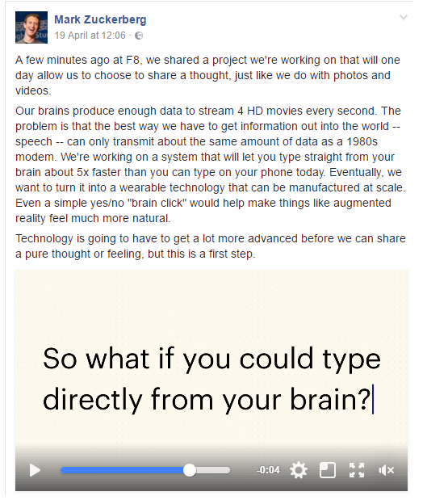

Facebook is collaborating with UC San Francisco, UC Berkeley, Johns Hopkins Medicine, Johns Hopkins University’s Applied Physics Laboratory and Washington University School of Medicine in St. Louis on this project. It is building hardware and software to mimic the cochlea in the ear which translates sound in specific frequencies for the brain. In the tests performed they have been able to use a vocabulary of 9 words to be hard through the skin.

**Neuralink**

Elon Musk’s Neuralink was publicly launched in March 2017.
The announcement was made the day after Facebook announced its BCI project. Elon Musk has referred few times to a “neural lace”, an AI layer which would augment human brain’s abilities. In a detailed report on the website Wait but why, they refer to it as a “Wizard Hat”.  It would be a “third layer” which would complement the other two: the limbic system and the cortex. The main idea of its creator is to build implantable devices to help humans keeping up with the raise of Artificial intelligence. In the beginnings the implants could be used to study the brain and to help in treating disease as depression or epilepsy.  Implantable electrodes would allow a much better quality than EEG, but the invasive technology raises many concerns. Implantable devices need to be safe, also in the long term, biocompatible have a wireless form of communication which would not degrade with time, the power problem need to be solved and Musk would needs to find volunteers for the experiments. Also Musk is talking about “one million simultaneously recorded neurons”, which is a huge number compared to the roughly maximum of 200 electrodes placed in current experiments. In a statement, the CEO of Neuralink said that “For a meaningful partial brain interface, I think we’re roughly four or five years away.”

**Kernel**

For Kernel as well the final goal is to allow humans to coexist and co-evolve with machines. Its founder, Bryan Johnson, invested $100 million to develop brain implants.  The focus will be first on medical applications, trying to understand better the brain, to move in the future toward augmenting it to make human smarter and healthier. Kernel promised to improve neurodegenerative diseases, a big claim as so far, brain implants had been using only in paraplegic people and for medical trials. [(38)](#references) They are developing hardware and software at the moment to treat people with Parkinsons disease and the company has at the moment about 20 employees.

## References  
1. Waldert, S. 2016. *Invasive vs. Non-Invasive Neuronal Signals for Brain-Machine Interfaces: Will One Prevail?* Available from: https://www.ncbi.nlm.nih.gov/pmc/articles/PMC4921501/

2. Mesgarani, N; Chang, EF. 2012. *Selective cortical representation of attended speaker in multi-talker speech perception*. Nature. 485 (7397): 233–6. doi:10.1038/nature11020.

3. Blausen.com staff (2014). *Medical gallery of Blausen Medical 2014*. WikiJournal of Medicine 1 (2). DOI:10.15347/wjm/2014.010. ISSN 2002-4436. - Own work

4. Leuthardt, E. C. et al. 2004. *A brain–computer interface using electrocorticographic signals in humans*. Journal of Neural Engineering, Volume 1, Number 2. Available from: http://iopscience.iop.org/article/10.1088/1741-2560/1/2/001/meta;jsessionid=E687A7B4A1215A8655C2DF6429F87A05.c2.iopscience.cld.iop.org

5. Schalk, G. et al. 2008. *Two-dimensional movement control using electrocorticographic signals in humans.* Journal of Neural Engineering, Volume 5, Number 1. Available from: http://iopscience.iop.org/article/10.1088/1741-2560/5/1/008/meta

6. MEG scanner with patient from National Institute of Mental Health. By Unknown NIMH author [Public domain], via Wikimedia Commons. Available from: https://en.wikipedia.org/wiki/Magnetoencephalography#/media/File:NIMH_MEG.jpg

7. Peter T. Lin, Kartikeya Sharma, Tom Holroyd, Harsha Battapady,
Ding-Yu Fei and Ou Bai (2013). A High Performance MEG Based BCI Using Single Trial Detection of Human Movement Intention, Functional Brain Mapping and the Endeavor to Understand the Working Brain, Dr. Francesco Signorelli (Ed.), InTech, DOI: 10.5772/54550. Available from: https://www.intechopen.com/books/functional-brain-mapping-and-the-endeavor-to-understand-the-working-brain/a-high-performance-meg-based-bci-using-single-trial-detection-of-human-movement-intention

8. Navin Lal, Thomas & al. A Brain Computer Interface with Online Feedback based on
Magnetoencephalography. Available from: http://www.machinelearning.org/proceedings/icml2005/papers/059_BrainComputer_LalEtAl.pdf

9. By Jens Maus (http://jens-maus.de/) - Own work, Public Domain, https://commons.wikimedia.org/w/index.php?curid=404712

10. Positron Emission Tomography (PET Scan). Available from: http://www.hopkinsmedicine.org/healthlibrary/test_procedures/neurological/positron_emission_tomography_pet_scan_92,p07654/

11. Wikipedia. Functional magnetic resonance imaging. Available from: https://en.wikipedia.org/wiki/Functional_magnetic_resonance_imaging.

12. Introduction to FMRI. Available from: https://www.ndcn.ox.ac.uk/divisions/fmrib/what-is-fmri/introduction-to-fmri

13. Wikipedia. Functional near-infrared spectroscopy. Available from: https://en.wikipedia.org/wiki/Functional_near-infrared_spectroscopy

14. Coyle, S., Ward, T. E., Markham, C. 2007. Brain–computer interface using a simplified functional near-infrared spectroscopy system. Available from: http://iopscience.iop.org/article/10.1088/1741-2560/4/3/007/pdf;jsessionid=7AEE10C6243EA9643C6DECB3555DAA24.ip-10-40-1-105

15. https://www.youtube.com/watch?v=me8kxvOuq40

16. fNIRS: The In-Between for Brain Activity in Real-World Settings. Available from: https://www.cogneurosociety.org/fnirs_wan/

17. fNIRS: The In-Between for Brain Activity in Real-World Settings. Available from: https://www.cogneurosociety.org/fnirs_wan/

18. Image available from: http://3.bp.blogspot.com/_TnLZz2ZDDxM/SsG-AuitJyI/AAAAAAAAAKA/BRZpWh3UrCc/s320/Brain_parts.gif

19. Wikipedia. Lobes of the brain. Available from: https://en.wikipedia.org/wiki/Lobes_of_the_brain

20. Neurons & glial cells. Available from: https://training.seer.cancer.gov/brain/tumors/anatomy/neurons.html

21. Sanei, S. (2013). Adaptive Processing of Brain Signals. Somerset: John Wiley & Sons, Incorporated. Retrieved from 30
http://ebookcentral.proquest.com/lib/dcu/detail.action?docID=1207774

22. Introduction to EEG and MEG. http://imaging.mrc-cbu.cam.ac.uk/meg/IntroEEGMEG#signalgeneration

23. Introduction to EEG and MEG. http://imaging.mrc-cbu.cam.ac.uk/meg/IntroEEGMEG#signalgeneration

24. Nicolas-Alonso, L. F., & Gomez-Gil, J. (2012). Brain Computer Interfaces, a Review. Sensors (Basel, Switzerland), 12(2), 1211–1279. http://doi.org/10.3390/s120201211

25. Sanei, S. 2013. Adaptive Processing of Brain Signals. John Wiley & Sons, Incorporated.

26. Wikimedia. https://commons.wikimedia.org/wiki/File:21_electrodes_of_International_10-20_system_for_EEG.svg

27. Tavakoli, P., Campbell, K. The recording and quantification of event-related potentials: I. stimulus presentation and data acquisition.

28.

29. Ochoa, J., 2002. EEG Signal Classification for Brain Computer Interface Applications.

30. Ochoa, J., 2002. EEG Signal Classification for Brain Computer Interface Applications.

31. Riera, A. EEG Signal Processing for Dummies. Available from: http://neuroelectrics.hs-sites.com/blog/bid/245833/EEG-Signal-Processing-for-Dummies?utm_content=10498748&utm_medium=social&utm_source=googleplus

32. Tarik Al-ani and Dalila Trad (2010). Signal Processing and Classification Approaches for Brain-Computer Interface, Intelligent and Biosensors, Vernon S. Somerset (Ed.), InTech, DOI: 10.5772/7032. Available from: https://www.intechopen.com/books/intelligent-and-biosensors/signal-processing-and-classification-approaches-for-brain-computer-interface

33. Shih, J. J., Krusienski, D. J., & Wolpaw, J. R. (2012). Brain-Computer Interfaces in Medicine. Mayo Clinic Proceedings, 87(3), 268–279. http://doi.org/10.1016/j.mayocp.2011.12.008

34. Shih, J. J., Krusienski, D. J., & Wolpaw, J. R. (2012). Brain-Computer Interfaces in Medicine. Mayo Clinic Proceedings, 87(3), 268–279. http://doi.org/10.1016/j.mayocp.2011.12.008

35. Shih, J. J., Krusienski, D. J., & Wolpaw, J. R. (2012). Brain-Computer Interfaces in Medicine. Mayo Clinic Proceedings, 87(3), 268–279. http://doi.org/10.1016/j.mayocp.2011.12.008

36. Emerging Theory and Practice in Neuroprosthetics by Yina Guo, Ganesh Naik. Chapter 10
Brain-Computer Interfaces for Assessment and Communication in Disorders of Consciousness

37. Neurosky. 2015. What Is BCI and How Did It Evolve?. Available from: http://neurosky.com/2015/06/what-is-bci-and-how-did-it-evolve/

38. Statt, N. 2017. KERNEL IS TRYING TO HACK THE HUMAN BRAIN — BUT NEUROSCIENCE HAS A LONG WAY TO GO. Available from: https://www.theverge.com/2017/2/22/14631122/kernel-neuroscience-bryan-johnson-human-intelligence-ai-startup

 <!-- end of content column -->

 <!-- end of row -->
